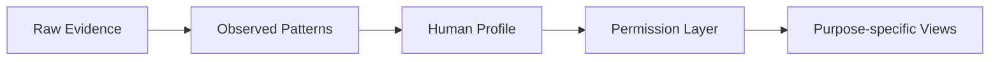

# Human Profile

**People. Context. Trust.**

Human Profile is an experimental platform exploring how people can represent more than static identity information: current context, well-being signals, commitments, behavioral evidence, longer-term observed patterns, and purpose-based sharing.

It does **not** determine whether someone is a “good” or “bad” person. It separates self-reported information, observed actions, independently verified information, and derived patterns—and makes the evidence behind patterns inspectable. Today, it is a local prototype with mock profile data and a working commitment-to-evidence pipeline.

## The Problem

Professional history, financial history, social content, and health information typically live in separate systems. Human Profile explores a user-controlled contextual profile that combines current state, historical behavior, and supporting evidence while letting individuals choose what different audiences see.

## Core Product Principle

**Evidence over judgment.** Derived metrics should be traceable to records, not opaque assessments of character.



The permission layer currently filters local previews; it is not server-enforced authorization.

## Currently Implemented

| Area | Working functionality | Current limits |
| --- | --- | --- |
| Home `/` | Current state, mini trends, pattern cards, commitment summary, evidence feed; Me/Employer/Landlord/Neighbor previews | State, well-being, and non-reliability pattern labels are mocked |
| My Profile `/profile` | Overview, Timeline, Evidence, About, Permissions; source counts/filters, evidence dialogs, editable About fields, audience controls | About/permissions are page-local; sharing opens a preview, not a public link |
| Commitments `/commitments` | Creation, deadlines, audience selection, completion/missed/cancelled actions, status filters, reliability breakdown | Session memory; terminal outcomes cannot yet be corrected |
| Shared interface | Reusable cards, responsive layouts, keyboard-operable tabs and native dialogs | Other sidebar destinations remain disabled |

Commitment outcomes update Home and My Profile through shared session state. Client-side navigation preserves these changes; refreshing restores deterministic sample data. No external verification is connected: existing **Verified** labels represent mock confirmations only.

## Commitments + Evidence Pipeline

**Commitment → Outcome → Evidence Event → Reliability Calculation → Profile Pattern**

Active commitments resolve as completed on time, completed late, missed, or cancelled. Completion at or before the deadline is on time; completion after it is late. Without a deadline, completion counts as on time. Missed and cancelled outcomes are explicitly recorded by the user.

```text
follow-through % = completedOnTime /
                   (completedOnTime + completedLate + missed) × 100
```

Active and cancelled commitments are excluded. The seeded history contains 50 on-time, 2 late, and 1 missed outcome: **94.34%**, displayed as **94%**. The profile uses a rolling six-calendar-month window, so fixed historical fixtures eventually age out.

Each transition records an **Observed** evidence event—not **Verified** evidence—with its commitment ID, expected date, completion date, outcome, and visibility. The evidence panel exposes the calculation and supporting records without hiding late or missed outcomes.

## Architecture

| Location | Responsibility |
| --- | --- |
| `app/`, `components/` | Routes, presentation, forms, and reusable UI |
| `domain/commitments/` | Validation, immutable state transitions, atomic outcome/evidence updates |
| `domain/evidence/` | Evidence models and outcome generation |
| `domain/patterns/` | Reliability calculation, observation window, shared profile read model |
| `components/commitments/CommitmentProvider.tsx` | Root-layout React context/reducer for shared session state |
| `data/`, `data/mocks/` | Mock profile records and deterministic commitment fixtures |
| `tests/` | Domain and profile-data tests |

See [pipeline design and assumptions](docs/commitment-pipeline.md). The earlier React application in `src/` is retained but excluded from the Next.js build.

## Engineering Decisions

- Commitment business rules live outside React. Reliability reads recorded commitment outcomes and links to their generated evidence.
- Observed means an application-recorded action, not independent confirmation of the underlying work.
- Active/cancelled commitments do not distort the denominator; duplicate dispatches do not duplicate evidence.
- Confidence is explicit: **0–4 observations: Low; 5–19: Medium; 20+: High**. This initial product rule is not a scientific assessment.
- Audience previews separate aggregate patterns from permission to inspect individual evidence. Home and My Profile currently use distinct preview rules.
- Mock data supports domain iteration; other qualitative patterns remain illustrative rather than validated calculations.

## Testing

**28 tests pass** in the current validation run. Coverage includes completed/late/missed outcomes, active/cancelled exclusions, zero eligible observations, confidence boundaries, deadline equality/timezones, validation, immutable transitions, duplicate actions, evidence traceability, calendar windows, and permission isolation.

Run `npm test`. Tests use Node’s built-in runner and the existing TypeScript compiler, without an additional test framework.

## Tech Stack

Next.js 15 (App Router), React 19, TypeScript, Tailwind CSS 4, ESLint, and Node’s built-in test runner.

## AI-Assisted Development

This project uses an AI-assisted engineering workflow with **OpenAI Codex** to accelerate implementation, refactoring, testing, and iteration. Product requirements, architecture decisions, domain modeling, constraints, and code review remain deliberate parts of the engineering process. AI-generated changes are inspected and validated rather than treated as proof of correctness.

## Roadmap — Future Work

Persistent database and authentication; Evidence v2/provenance and external verification; evidence disputes/corrections; wearable and other API integrations; family aggregation; a richer permission engine; deployment and observability.

## Privacy / Responsible Design

The design prioritizes user control, purpose-specific sharing, evidence provenance, explainable patterns, and avoiding opaque character scoring. This is an experimental personal project using mock data. All records ship in the client bundle; UI visibility controls are not a security boundary. There is no authentication, real sharing, or connected health/financial data.

## Local Development

```bash
npm install
npm run dev       # http://localhost:3000
npm test
npm run lint
npm run typecheck
npm run build
npm start         # serve the production build
```

Stop the dev server before building; both use `.next/`. Keep credentials, `.env` files, dependency folders, and generated output out of Git.

## Project Status

**Active personal product project / experimental prototype.** The commitment pipeline is functional locally; persistence, external verification, and production access controls are future work.
