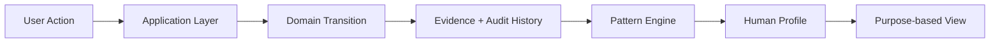
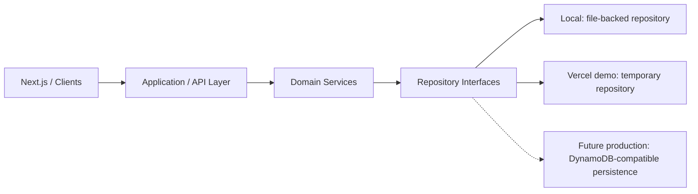

# Human Profile

**People. Context. Trust.**

Human Profile is an interactive Next.js platform exploring how people can represent current context, behavioral evidence, and longer-term patterns without reducing a person to an opaque score.

🌐 **Live Demo:** [human-profile.vercel.app](https://human-profile.vercel.app/)

### What it demonstrates

- **Commitment → Outcome → Evidence → Pattern → Profile**, with explainable derived reliability.
- **Auditable Evidence v2:** provenance, corrections, disputes, verification status, and revocation.
- **Purpose-based profile visibility:** different audiences see different selected evidence and context.
- **Application/domain/repository separation:** non-relational persistence architecture with isolated public demo state.

The public demo uses fictional data and temporary isolated state. No real health, wearable, reference, or external verification integrations are connected.

Human Profile is currently a public interactive prototype. Local development uses durable file-backed persistence, while the public Vercel demo uses isolated temporary state.

## Authentication & Profile Ownership v1

The public demo remains anonymous. **Continue with Google** opens Clerk sign-in; authenticated users enter **`/me`**, a separate private profile that starts empty. Google must be enabled in Clerk before sign-in is available. Missing credentials leave the recruiter demo working.

Clerk verifies the session at the server boundary and maps its stable user ID to Human Profile's `AuthenticatedIdentity.subject`. Email and browser-supplied owner IDs never determine ownership. Private API operations use only the server-derived owner partition; domain/application layers do not import Clerk.

Private storage is **development-only**: local files on your machine, or separate temporary owner memory on Vercel. This is not durable production persistence. Demo data is never promoted into a private account. See [authentication setup, security boundaries, and exact Clerk/Google/Vercel steps](docs/authentication-v1.md), and copy the blank variable names from [.env.example](.env.example) into an ignored local environment file.

## Architecture at a Glance



## Live Demo

[Explore Human Profile on Vercel](https://human-profile.vercel.app/).

1. Explore **My Profile** and its patterns.
2. Open **Commitments** and create or complete a commitment.
3. Open the generated evidence to inspect provenance and audit history.
4. Return to **My Profile → View As** and **Permissions** to try purpose-based views.

Changes may survive requests within the same active runtime, but can reset on expiry, eviction, or a new server instance. This is an experimental product, not a production service; use fictional information only.

## The Problem

Professional history, financial history, social content, and health information typically live in separate systems. Human Profile explores a user-controlled contextual profile that combines current state, historical behavior, and supporting evidence while letting individuals choose what different audiences see.

## Core Product Principle

**Evidence over judgment.** Derived metrics should be traceable to records, not opaque assessments of character.

Current state describes temporary context, such as today’s self-reported well-being. Long-term patterns summarize observations over time. A temporary state or isolated outcome must not become a permanent conclusion about someone being good/bad, honest/dishonest, or trustworthy/untrustworthy.

Purpose-based visibility currently filters UI previews; it is not server-enforced audience authorization.

## Currently Implemented

| Area | Working functionality | Current limits |
| --- | --- | --- |
| Home `/` | Current state, mini trends, pattern cards, commitment summary, evidence feed; Me/Employer/Landlord/Neighbor previews | State, well-being, and non-reliability pattern labels are mocked |
| My Profile `/profile` | Overview, Timeline, Evidence, About, Permissions; source counts/filters, evidence dialogs, editable About fields, audience controls | Persistence depends on runtime mode; sharing opens a preview, not a public link |
| Commitments `/commitments` | Creation, deadlines, audience selection, completion/missed/cancelled actions, status filters, reliability breakdown | Local durable or public temporary storage; terminal outcomes cannot yet be corrected |
| Shared interface | Reusable cards, responsive layouts, keyboard-operable tabs and native dialogs | Unimplemented destinations are hidden in public demo navigation or disabled locally |

Commitment outcomes update Home and My Profile through a shared server-confirmed snapshot. Commitments, evidence/audit history, About fields, and permissions survive refresh and restart in **local mode**; in the **public demo**, they remain only while that visitor’s temporary repository is available.

### Mocked or unavailable today

Most well-being signals, health information, work history, family information, references, and external verification are prototype data. Wearable data is not connected to a real integration. These screens and sample confirmations do not represent real integrations. Production database infrastructure remains future work.

## Commitments + Evidence Pipeline

Today, the pattern engine is the domain reliability calculation and shared profile read model, not a separate service.

Active commitments resolve as completed on time, completed late, missed, or cancelled. Completion at or before the deadline is on time; completion after it is late. Without a deadline, completion counts as on time. Missed and cancelled outcomes are explicitly recorded by the user.

```text
eligibleCommitments = completedOnTime + completedLate + missed
followThroughRate = completedOnTime / eligibleCommitments * 100
```

Active and cancelled commitments are excluded. The profile also excludes outcomes with missing, disputed, or revoked supporting evidence; resolving a dispute can restore eligibility. The seeded history contains 50 on-time, 2 late, and 1 missed outcome: **50 / 53 × 100 = 94.34%**, displayed as **94%**. The profile uses a rolling six-calendar-month window. Local mode uses the real clock, so fixed historical fixtures eventually age out; public demo mode uses a simulated September 2026 clock to keep the seeded experience useful.

Confidence remains count-based: **0–4 eligible observations: Low; 5–19: Medium; 20+: High**. This is an initial product rule, not a scientific model. Source quality, verification, and recency are future extensions; none is weighted today.

Each transition records an **Observed** evidence event—not **Verified** evidence—with its commitment ID, expected date, completion date, outcome, and visibility. The evidence panel exposes the calculation and supporting records without hiding late or missed outcomes.

## Evidence Semantics

- **Self-reported:** information explicitly entered by the user.
- **Observed:** behavior or a state transition observed by Human Profile.
- **Verified:** evidence independently confirmed by an external source.

Completing a commitment inside Human Profile creates **Observed**, not **Verified**, evidence. It records the application transition without independently confirming that the underlying work happened. The current public demo only simulates external verification workflows. Clicking a demo verification action does not establish real independent confirmation.

## Evidence v2

Every record has a source classification (`sourceType`), original provenance (`user`, `human-profile`, or `external-source`), source details, creation time, occurrence time (the existing `timestamp`), visibility, and audit history. `type` remains the activity/commitment-outcome discriminator. Commitment records link their entity and outcome metadata; optional confidence is available without invented per-record scores.

Verification status is separate from type: **unverified, pending, verified, disputed, or revoked**. Recorded commitment outcomes begin as **Observed + unverified**. A verification request does not turn an observation into a confirmation.

| Action | Implemented behavior |
| --- | --- |
| Request verification | Self-reported/observed unverified records become pending; duplicate requests are rejected |
| Verify (demo) | Simulates confirmation with a mock external source and source ID; sets type/status to verified; duplicate verification is rejected |
| Dispute | Requires a reason; excludes evidence from patterns while unresolved |
| Correct text | Requires a reason and changed title/description; preserves before/after values and invalidates prior verification |
| Resolve dispute | Requires a reason; restores the preceding status, or unverified if corrected; preserves every audit entry |
| Revoke | Requires a reason; retains the record but excludes it from patterns; no restore action |

Audit entries append IDs, timestamps, actors/sources, notes, and before/after snapshots of mutable fields. Backdated entries and duplicate IDs are rejected; equal timestamps preserve append order. Immutable origin, occurrence, entity metadata, and visibility remain on the record. History is stored with the evidence record: durably in local mode and temporarily in public demo mode. It is inspectable, not tamper-proof; local files can be edited by someone with filesystem access.

Open **My Profile → Evidence → a record** to inspect provenance, dates, visibility, pattern contribution, and audit history. Owner-only demo actions exercise all transitions, including text corrections. Audience previews retain existing filtering and hide owner audit notes and action controls. Revoked/disputed records remain inspectable in the owner view. Summary counts track current types and statuses; qualitative mock patterns update their eligible supporting records.

Six additional deterministic private demo records cover the Evidence v2 states. The seed has **136 records: 35 self-reported, 82 observed, 19 verified**, including one pending, one disputed, and one revoked record. These examples do not change the **50/53 reliability fixture**.

Corrections currently cover evidence title/description; commitment outcome/date revisions, undoing revocation, and production dispute processing remain future work. Original provenance records the origin even when a later correction changes the current classification.

## Architecture

| Location | Responsibility |
| --- | --- |
| `app/`, `components/` | Routes, presentation, forms, and reusable UI |
| `domain/commitments/` | Validation, immutable state transitions, atomic outcome/evidence updates |
| `domain/evidence/` | Evidence v2 models, immutable services, audit snapshots, and outcome generation |
| `domain/patterns/` | Reliability calculation, observation window, shared profile read model |
| `components/commitments/CommitmentProvider.tsx` | Loads server snapshots; publishes only confirmed saves; loading/error/reload controls |
| `app/api/profile-state/`, `server/` | Node route handlers, validation, runtime mode, development identity, and anonymous demo sessions |
| `application/` | Repository contracts and workflow orchestration |
| `persistence/` | Atomic local file adapter, bounded public demo repository, and memory test adapter |
| `data/`, `data/mocks/` | Mock profile records and deterministic commitment fixtures |
| `tests/` | Domain, profile-data, backend, and public-demo tests |

See [pipeline design and assumptions](docs/commitment-pipeline.md). The earlier React application in `src/` is retained but excluded from the Next.js build.

## Engineering Highlights

- **Next.js App Router + TypeScript:** shared route state with loading, error, and confirmed-save behavior.
- **Domain logic outside React:** deterministic commitment/evidence transitions and explainable derived patterns; UI components do not calculate reliability.
- **Application service orchestration:** existing domain services run inside user-scoped repository transactions.
- **Non-relational repository architecture:** environment-aware selection between atomic local document persistence and isolated temporary public-demo memory.
- **Evidence v2 audit model:** append-oriented history preserves meaningful transitions, provenance, and corrections. This is event-oriented design, not full event sourcing.
- **Purpose-based visibility:** aggregate patterns and individual evidence have separate preview controls. Home and My Profile retain distinct audience rules.
- **Automated tests and a Vercel public demo:** repository isolation, workflow invariants, and error handling are exercised alongside the domain model.

## Testing

**99 tests pass** in the current validation run. Coverage includes completed/late/missed outcomes, active/cancelled exclusions, zero eligible observations, confidence boundaries, deadline equality/timezones, validation, immutable transitions, duplicate actions, evidence traceability, calendar windows, and permission isolation. Evidence v2 tests cover creation, source attribution, verification, disputes/restoration, corrections, revocation, ordered audit snapshots, immutable provider updates, and pattern exclusions.

Backend tests additionally cover repository round trips, user isolation, reloads, seed/reset behavior, concurrent writes, atomic failure handling, authoritative request parsing, and persisted Evidence v2 eligibility. They use isolated temporary directories, never your runtime file. Public-demo tests cover environment selection, deterministic initialization, visitor isolation, temporary-state lifecycle and limits, cookie identity, and request boundaries.

Authentication tests cover anonymous access, server-derived ownership, missing sessions, owner spoofing, cross-user isolation, empty initialization, private storage, framework boundaries, and the initial Home HTML.

Run `npm test`. Tests use Node’s built-in runner and the existing TypeScript compiler, without an additional test framework.

## Tech Stack

Next.js 15 (App Router), React 19, TypeScript, Clerk 7 (Google authentication), Tailwind CSS 4, ESLint, and Node’s built-in test runner.

## AI-Assisted Development

This project is being developed using an AI-assisted engineering workflow with OpenAI Codex.

AI is used to accelerate implementation, refactoring, testing and iteration. Product requirements, architecture decisions, domain modeling, constraints and code review remain deliberate parts of the engineering process.

## Runtime Modes

The application and domain services share repository contracts across modes; storage and identity selection happen on the server. The table below describes the existing public demo. Private `/me` uses separate owner storage as documented above.



| Mode | Repository and identity | State lifetime |
| --- | --- | --- |
| **Local development** | File-backed JSON; centralized development user | Survives navigation, refresh, and server restart |
| **Public Vercel demo** | Temporary in-memory repository; isolated anonymous visitor session | Non-durable; may reset across requests, instances, expiry, or eviction |
| **Future production** | DynamoDB-compatible persistence behind the authenticated owner boundary | Planned; no DynamoDB adapter exists today |

`server/runtime-mode.ts` defaults to local mode outside Vercel. `HUMAN_PROFILE_MODE=public-demo` enables demo mode explicitly; `VERCEL=1` always selects demo mode, even if a local override was configured. No secrets or client-side environment variables are required for the public demo; private sign-in requires the Clerk configuration above. `HUMAN_PROFILE_DATA_DIR` applies only to local storage and is ignored by public demo selection.

### Public demo behavior

A random session cookie identifies each visitor’s isolated state (`HttpOnly`, `SameSite=Lax`, and `Secure` over HTTPS). This is anonymous demo isolation, not authentication. The public demo does **not** use local file-backed persistence or browser localStorage.

Each server instance holds bounded temporary repositories: up to 50 visitor sessions, expiring after 30 minutes without repository access. Capacity eviction, server restarts, or routing to another instance can reset state; a cookie does not make that state durable. Session limits also cap records and audit entries. The provider refreshes its snapshot every minute and on focus.

Demo time starts at September 12, 2026 and advances with the server instance’s elapsed time. This simulated timeline keeps the existing fixtures meaningful without changing domain calculations. New temporary repositories initialize from the same fictional seed.

### Shared application / API boundary

`GET /api/profile-state` loads a user-scoped snapshot and derived reliability. `POST /api/profile-state` accepts commitment, evidence, or profile commands. The application service calls existing domain functions inside a repository transaction, then returns the confirmed repository result. UI state is not optimistically changed; failed saves show an error and a reload control. Server timestamps and demo verification attribution are authoritative.

### Local durable persistence

The file adapter stores one versioned JSON document per user under **`.human-profile-data/<userId>.json`**. Commitment and evidence envelopes carry `ownerId`; the profile envelope holds About/permissions. A per-user filesystem lock serializes transactions across local processes. Writes flush a temporary file and atomically rename it, so outcome and evidence cannot be partially published. Repository interfaces keep files, JSON, React, Next.js, and AWS outside the domain layer. Reliability is calculated from saved records, never persisted as a primary score.

The **local** temporary identity is centralized in `server/development-session.ts` as `dev-user-001`. Routes do not accept browser-supplied owner IDs. This is **not authentication**: local clients share the development identity. Development and production-build preview commands bind to loopback; local mode rejects foreign Host/Origin values, while public demo mode permits its deployment domain and rejects cross-origin mutations. Use mock/dev data only.

First access initializes existing deterministic commitments and all Evidence v2 examples if the user has no records. A saved profile marks initialization; reloads do not reseed. If a partial partition has records but no profile, only profile defaults are added. The initial reliability fixture is preserved within its observation window.

To reset, **stop the server**, run `npm run reset:data`, then restart. The reset command moves the entire store to a recoverable timestamped backup and the next request seeds fresh data. Runtime files, locks, temporary writes, and default backups are gitignored. Optional server-only `HUMAN_PROFILE_DATA_DIR` selects another local directory; no environment file or credentials are required. Keep custom directories and their backups outside Git.

See [Backend v1 details](docs/backend-v1.md) for transaction guarantees, reset/recovery, and limitations.

## Future Backend Architecture

```text
Wearables / External Systems
        ↓
      Kafka
        ↓
    Consumers
        ↓
Normalized Evidence
        ↓
Pattern Engine
        ↓
Human Profile
```

**DynamoDB and Kafka are not implemented.** The preferred future direction is document/key-value persistence, not a relational-first backend. A possible DynamoDB key strategy is `PK = USER#<userId>` with `SK = PROFILE`, `COMMITMENT#<id>`, or `EVIDENCE#<id>`. Audit history starts embedded; a future adapter must address growth, pagination, transaction limits, and conditional updates. No AWS SDK or adapter skeleton was added.

Forms remain event producers through domain transitions and evidence. Wearables may eventually be additional producers. Introduce Kafka only when asynchronous/high-volume integration needs justify it.

## Roadmap — Future Work

- Production DynamoDB adapter behind the implemented Clerk owner boundary, plus production operational controls.
- Commitment outcome/date revisions, reversal workflows, and production evidence audit/dispute operations. Evidence provenance, verification status, text corrections, disputes, and audit history are already implemented.
- External verification and wearable integrations.
- Kafka-based event ingestion when justified.
- Richer family/group aggregation and a richer permission engine.
- Public/integration APIs and production infrastructure/observability beyond the current Vercel demo.

## Privacy / Responsible Design

The design prioritizes user control, purpose-specific sharing, evidence provenance, explainable patterns, and avoiding opaque character scoring. This public interactive prototype uses fictional data. The API returns the current local user’s or demo visitor’s full snapshot; UI audience previews are not a security boundary. Sample fixtures also remain in the client bundle for illustrative sections. The demo remains unauthenticated. Private `/me` requires Clerk authentication and exposes only the authenticated owner’s records. Real sharing and connected health/financial data are not implemented.

## Local Development

```bash
npm install
npm run dev       # http://localhost:3000
npm test
npm run lint
npm run typecheck
npm run build
npm start         # preview the production build on loopback
# Optional: run the public demo repository locally
HUMAN_PROFILE_MODE=public-demo npm run dev
# Stop the server before resetting:
npm run reset:data # archive local data; next access seeds fresh mock records
```

Stop the dev server before building; both use `.next/`. Keep credentials, `.env` files, dependency folders, and generated output out of Git.

## Project Status

**Public interactive prototype / experimental product.** The live demo, commitment pipeline, and durable local and temporary public repository modes are implemented, along with Clerk authentication and private owner isolation. Durable production persistence, external verification, and multi-user authorization remain future work.
